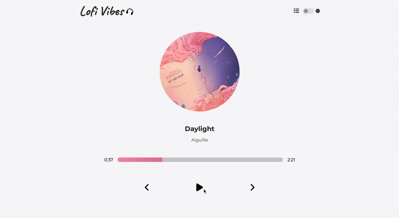

# Music Player React

This is a music player application built with React.



## Live Demo

You can access the live demo of this music player here. - [Lofi Vibes](https://stirring-seahorse-18cf7b.netlify.app/)

## Tech Used

* REACT JS
* SASS
* CONTEXT API
* CUSTOM HOOKS
* CSS ANIMATIONS
* MEDIA QUERIES FOR MOBILE RESPONSIVE

## Installation
1. Clone this repo.

```
https://github.com/abbie930/music-player
```
2. Install the dependencies and devDependencies and start the application.

<br/>

Using npm

```
$ cd music-player
$ npm install
$ npm run start
```
